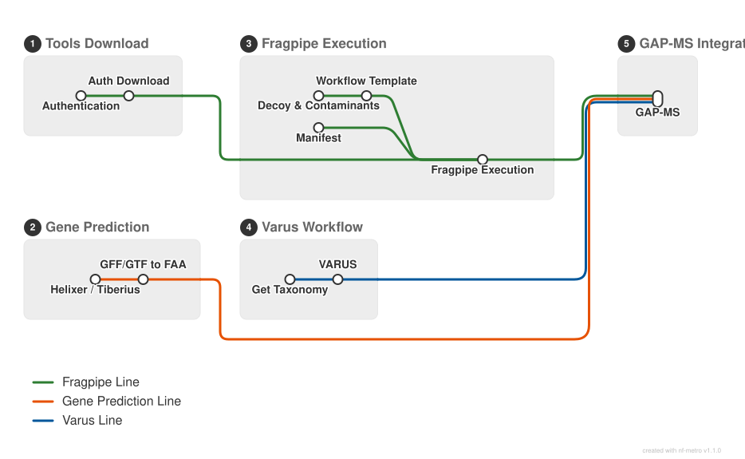

# GAP-MS-nextflow
A Nextflow pipeline connecting GAP-MS with upstream and downstream analysis, incorporating FragPipe, Tiberius/Helixer, and VARUS for Proteogenomics analysis.


---

## Installation 
### Prerequisites: Miniconda Installation
For more information visit: https://docs.conda.io/projects/conda/en/latest/user-guide/install/index.html
```bash
curl -O https://repo.anaconda.com/miniconda/Miniconda3-latest-Linux-x86_64.sh
bash Miniconda3-latest-Linux-x86_64.sh
```

### Conda setup 
```bash
conda create -n gapms_pipeline_env -c conda-forge -c bioconda nextflow python=3.11 -y
conda activate gapms_pipeline_env

git clone https://github.com/qussai96/GAP-MS-nextflow.git
cd GAP-MS-nextflow
pip install .
```
## Usage 
### Download of licensed FragPipe components
FragPipe requires the licensed components MSFragger, IonQuant, and DiaTracer. These tools are available free of charge for academic research, non-commercial, and educational use under an academic license. For commercial use, visit [Fragmatics](https://www.fragmatics.com/) or contact info@fragmatics.com. Aditional information is available at the [FragPipe](https://fragpipe.nesvilab.org/docs/tutorial_fragpipe.html) website.

If the licensed components have already been obtained, their location can be provided using the --config_tools_folder parameter.

If the components are not yet available, an automated download process is initiated when the pipeline starts. During this process, the user's first name, last name, academic email address, and institution must be provided. A six-character verification code is then sent by email and must be entered into the terminal. Once the download has completed successfully, the remaining pipeline processes start automatically.

### Nextflow config setup
It is possible to change various settings in the nextflow.config file. If needed, the cluster configuration can be modified, including the CPU/GPU and memory resources allocated to individual processes.

### Running the Pipeline
```bash
nextflow run main.nf \
  --raw_ms_files "/path/to/raw_ms_files_folder" \
  --fasta_file "/path/to/protein_fasta_file" \
  --genome_fasta "/path/to/genome_fasta"
```

## Parameters 
|Parameter|Description|
|---------|-----------|
| --raw_ms_files  | Path to the raw MS files folder (required) |
| --fasta_file  | Path to the protein FASTA file (required)  |
| --genome_fasta  | Path to the genome FASTA file (required)  |

**FragPipe Workflow**
|Parameter|Description|
|---------|-----------|
| --config_tools_folder  | Path to the folder containing the required FragPipe tools if MSFragger, IonQuant, and DiaTracer (if avalible) |
| --add_contaminants  | Enables or disables the addition of contaminants during the decoy generation step (default: true)  |

**Gene Prediction Workflow**
|Parameter|Description|
|---------|-----------|
| --genome_option  | Choice of gene prediction tool: Helixer or Tiberius (default: Tiberius) |
| --lineage_helixer  | Helixer lineage model (default: land_plant)  |
| --model_cfg  | Tiberius model configuration (default: angiosperms)   |

**VARUS Workflow**
|Parameter|Description|
|---------|-----------|
| --taxID  | Taxonomic identifier. If --taxID is not specified, the VARUS workflow will be skipped and no BAM files will be produced |

**GAP-MS Process**
|Parameter|Description|
|---------|-----------|
| --mapping | Optional peptide-to-protein mapping file  |
| --scores | Optional CSV with columns: Protein, external_scor  |
| --reference_gtf | Optional reference GTF for comparison  |
| --reference_fasta | Optional reference protein FASTA  |
| --iterative | Train an iterative XGBoost model instead of using the pre-trained classifier  |
| --output | Output directory (default: GAPMS_output/results/) |


